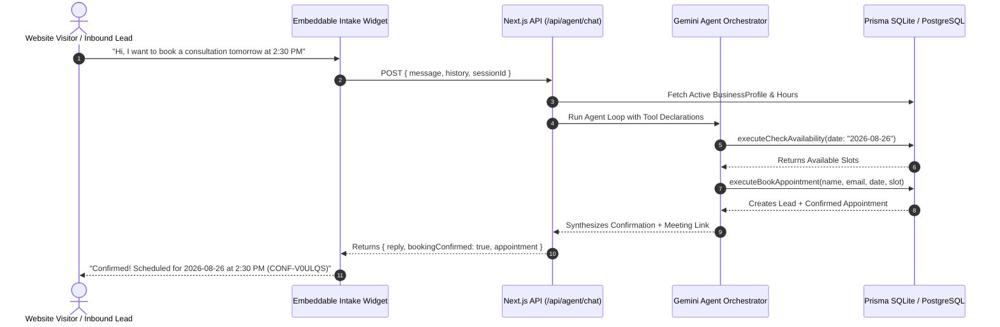

# 🏢 LeadRescue AI — Autonomous Inbound Intake & Calendar Booking Platform

[](https://nextjs.org/)
[](https://www.typescriptlang.org/)
[](https://tailwindcss.com/)
[](https://www.prisma.io/)
[](https://ai.google.dev/)
[](https://opensource.org/licenses/MIT)

> An enterprise-grade, full-stack B2B SaaS platform that automatically qualifies inbound customer inquiries, executes real-time database tool calls to prevent double-booking, and synchronizes appointments directly to your operational dashboard.

---

## ⚡ Key Capabilities

* 🤖 **Autonomous Tool-Calling Loop:** Integrates Google Gemini (`@google/genai` & `@google/generative-ai`) to dynamically execute tools:
  * `check_calendar_availability(date, serviceType)`
  * `book_calendar_appointment(customerName, phone, email, date, timeSlot, serviceType)`
  * `save_lead_to_crm(name, phone, email, serviceRequested, urgency, budget)`
* 📊 **Enterprise B2B Dashboard:** Stripe & Linear-inspired clean light UI with real-time KPI metrics, pipeline revenue estimations, and an inquiry dispatch queue.
* 💬 **Embeddable Customer Intake Widget:** Floating chat bubble that can be embedded into any website via a 1-line script tag with `sessionStorage` context persistence.
* 🗄️ **Persistent CRM & Schedule:** Relational SQLite / PostgreSQL database backed by Prisma ORM tracking Leads, Confirmed Appointments, and Message Audit Logs.
* 🛡️ **Zero-Downtime Heuristic Fallback:** Intelligent conversational rules ensure uninterrupted booking functionality even during external API downtime.

---

## 🏗️ System Architecture



---

## 🚀 Quick Start Guide

### 1. Clone the Repository
```bash
git clone https://github.com/PINNACLEAISOLUTIONS/doctorapp.git
cd doctorapp
```

### 2. Install Dependencies
```bash
npm install
```

### 3. Configure Environment Variables
Create a `.env` file in the root directory (or copy `.env.example`):
```env
DATABASE_URL="file:./dev.db"
GEMINI_API_KEY="your_google_gemini_api_key_here"
GEMINI_MODEL="gemini-1.5-flash"
NEXT_PUBLIC_APP_URL="http://localhost:3000"
WEBHOOK_SECRET_TOKEN="your_secure_webhook_token"
```
> 💡 *Get a free Gemini API key at [ai.google.dev](https://aistudio.google.com/).*

### 4. Initialize and Seed the Database
```bash
npx prisma db push
npm run prisma:seed
```

### 5. Start the Development Server
```bash
npm run dev
```

Open your browser at **[http://localhost:3000](http://localhost:3000)**.

---

## 🖥️ Platform Navigation & Routes

| URL Route | Name | Description |
| :--- | :--- | :--- |
| `/dashboard` | **Operations & Dispatch Portal** | High-level KPI metrics, live lead queue, and communication audit drawer. |
| `/widget-preview` | **Live Intake Simulation** | Mock customer landing page demonstrating the embedded chat widget. |
| `/settings` | **Business Rules & Hours** | Configure services, operating hours, base pricing, and agent system prompts. |
| `/api/agent/chat` | **Agent Chat Endpoint** | Multi-turn conversational endpoint with tool calling. |
| `/api/dashboard/stats`| **Analytics API** | Real-time lead count, conversion %, and pipeline values. |
| `/api/webhook/inbound`| **Inbound Webhook** | Ingestion pipeline for Twilio SMS or external contact forms. |

---

## 🔌 1-Line Website Embed Snippet

Embed the automated booking assistant on any client website by adding this script tag:

```html
<!-- LeadRescue Automated Intake Widget -->
<script 
  src="https://cdn.apexgrowth.ai/intake-widget.js" 
  data-account-id="apex_growth_2026" 
  async>
</script>
```

---

## 📦 Project Structure

```
├── app/
│   ├── api/
│   │   ├── agent/chat/route.ts      # Multi-turn Gemini tool-calling endpoint
│   │   ├── dashboard/stats/route.ts # KPI and pipeline value aggregation
│   │   ├── leads/route.ts           # Inbound CRM lead management
│   │   ├── appointments/route.ts    # Calendar booking records
│   │   ├── settings/route.ts        # Business profile and operating hours
│   │   └── webhook/inbound/route.ts # Inbound SMS/Form webhook intake
│   ├── dashboard/page.tsx           # Enterprise SaaS operations dashboard
│   ├── settings/page.tsx            # Business rules & schedule configuration
│   ├── widget-preview/page.tsx      # Embed preview & script tag generator
│   ├── layout.tsx                   # B2B light-mode layout
│   └── globals.css                  # Custom styling & utilities
├── components/
│   ├── ChatWidget.tsx               # Floating customer intake chat bubble
│   ├── LeadStream.tsx               # Real-time customer inquiry feed
│   ├── CalendarAgenda.tsx           # Confirmed discovery sessions & Meet links
│   ├── TranscriptDrawer.tsx         # Full communication transcript modal
│   └── Navbar.tsx                   # Top navigation bar
├── lib/
│   ├── agent.ts                     # Gemini Function Declarations & Dispatcher
│   ├── tools.ts                     # Prisma-backed execution handlers
│   └── prisma.ts                    # Prisma singleton client
├── prisma/
│   ├── schema.prisma                # Relational SQLite/PostgreSQL schema
│   └── seed.ts                      # Database seeding script (4 leads, 2 appointments)
├── package.json
└── tsconfig.json
```

---

## 🔒 Security Best Practices
* **Zero Secret Exposure:** `.env` and SQLite files are strictly blocked in `.gitignore`.
* **API Route Protection:** Webhook routes utilize token-based secret verification (`WEBHOOK_SECRET_TOKEN`).
* **Input Sanitization:** All inbound contact strings and phone numbers are normalized prior to persistence.

---

## 📄 License
Distributed under the **MIT License**. Free for commercial and open-source use.
